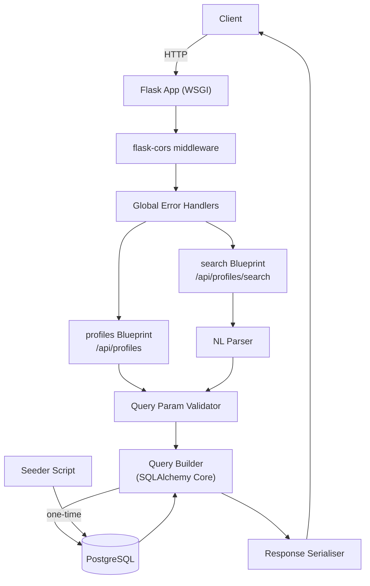

# Design Document: Intelligence Query Engine

## Overview

The Intelligence Query Engine is a Flask-based REST API backend for Insighta Labs. It stores demographic profile data in PostgreSQL and exposes two endpoints: a filterable/sortable/paginated profiles listing endpoint (`GET /api/profiles`) and a natural language search endpoint (`GET /api/profiles/search`). The system also includes a one-time idempotent data seeder that loads 2026 profiles from a JSON file.

The design prioritises:
- **Correctness**: parameterised queries, strict input validation, and well-defined error responses
- **Performance**: database-level filtering, pagination, and targeted indexes
- **Simplicity**: rule-based NL parsing with no external AI dependencies
- **Testability**: pure parsing logic separated from I/O, enabling property-based testing

### Key Technical Decisions

| Decision | Choice | Rationale |
|---|---|---|
| Framework | Flask 3.x (application factory + Blueprints) | Lightweight, modular, well-understood |
| Database | PostgreSQL 15+ | Native UUID support, robust indexing, CHECK constraints |
| DB access | SQLAlchemy Core (not ORM) | Query builder safety without ORM overhead; raw SQL for complex dynamic filters |
| UUID v7 | `uuid-utils` PyPI package | Actively maintained Rust-backed library; generates spec-compliant UUID v7 |
| CORS | `flask-cors` extension | Handles preflight and header injection with one-line setup |
| PBT library | `hypothesis` | De-facto standard for Python property-based testing; integrates with pytest |

---

## Architecture

The system follows a layered architecture with clear separation between HTTP handling, business logic, and data access.



### Project Layout

```
intelligence-query-engine/
├── app/
│   ├── __init__.py          # Application factory: create_app()
│   ├── config.py            # Config classes (Development, Testing, Production)
│   ├── extensions.py        # SQLAlchemy engine + connection pool init
│   ├── blueprints/
│   │   ├── profiles/
│   │   │   ├── __init__.py  # Blueprint registration
│   │   │   ├── routes.py    # GET /api/profiles handler
│   │   │   └── validator.py # Query param validation logic
│   │   └── search/
│   │       ├── __init__.py  # Blueprint registration
│   │       └── routes.py    # GET /api/profiles/search handler
│   ├── db/
│   │   ├── schema.py        # SQLAlchemy Table definitions (Core, not ORM)
│   │   └── queries.py       # Reusable query-building functions
│   ├── nl_parser/
│   │   ├── __init__.py
│   │   ├── parser.py        # Rule-based NL → filter dict
│   │   └── country_map.py   # Country name → ISO alpha-2 lookup table
│   └── serialisers.py       # Row → JSON-serialisable dict conversion
├── scripts/
│   └── seed.py              # Idempotent data seeder
├── tests/
│   ├── conftest.py          # pytest fixtures (test app, test DB)
│   ├── unit/
│   │   ├── test_nl_parser.py
│   │   └── test_validator.py
│   └── integration/
│       ├── test_profiles_endpoint.py
│       └── test_search_endpoint.py
├── data/
│   └── profiles.json        # Source data for seeder
├── .env.example
├── requirements.txt
├── README.md
└── run.py                   # Entry point: app = create_app()
```

---

## Components and Interfaces

### 1. Application Factory (`app/__init__.py`)

```python
def create_app(config_name: str = "development") -> Flask:
    app = Flask(__name__)
    app.config.from_object(config[config_name])

    # Extensions
    CORS(app, resources={r"/api/*": {"origins": "*"}})
    init_db(app)

    # Blueprints
    from app.blueprints.profiles import profiles_bp
    from app.blueprints.search import search_bp
    app.register_blueprint(profiles_bp, url_prefix="/api")
    app.register_blueprint(search_bp, url_prefix="/api")

    # Error handlers
    register_error_handlers(app)

    return app
```

### 2. Database Layer (`app/db/`)

**Schema definition** uses SQLAlchemy Core `Table` objects (not ORM declarative models). This gives full control over SQL generation while still using parameterised binds.

```python
# app/db/schema.py
from sqlalchemy import Table, Column, String, Integer, Float, DateTime, MetaData, CheckConstraint, UniqueConstraint

metadata = MetaData()

profiles_table = Table(
    "profiles",
    metadata,
    Column("id", String(36), primary_key=True),          # UUID v7 stored as string
    Column("name", String, nullable=False),
    Column("gender", String, nullable=False),
    Column("gender_probability", Float, nullable=False),
    Column("age", Integer, nullable=False),
    Column("age_group", String, nullable=False),
    Column("country_id", String(2), nullable=False),
    Column("country_name", String, nullable=False),
    Column("country_probability", Float, nullable=False),
    Column("created_at", DateTime(timezone=True), server_default="now()"),
    CheckConstraint("gender IN ('male', 'female')", name="ck_gender"),
    CheckConstraint("age_group IN ('child', 'teenager', 'adult', 'senior')", name="ck_age_group"),
    CheckConstraint("length(country_id) = 2", name="ck_country_id_len"),
    UniqueConstraint("name", name="uq_name"),
)
```

**Query builder** (`app/db/queries.py`) constructs dynamic WHERE clauses from a validated filter dict:

```python
def build_profile_query(filters: dict, sort_by: str, order: str, page: int, limit: int):
    """Returns (data_query, count_query) as SQLAlchemy select objects."""
    ...
```

### 3. Query Parameter Validator (`app/blueprints/profiles/validator.py`)

Validates and coerces raw Flask `request.args` into a typed `FilterParams` dataclass. Raises `ValidationError` (400) or `TypeError` (422) on invalid input.

```python
ALLOWED_PARAMS = frozenset({
    "gender", "age_group", "country_id",
    "min_age", "max_age", "min_gender_probability", "min_country_probability",
    "sort_by", "order", "page", "limit",
})

VALID_GENDERS = frozenset({"male", "female"})
VALID_AGE_GROUPS = frozenset({"child", "teenager", "adult", "senior"})
VALID_SORT_BY = frozenset({"age", "created_at", "gender_probability"})
VALID_ORDERS = frozenset({"asc", "desc"})

@dataclass
class FilterParams:
    gender: str | None
    age_group: str | None
    country_id: str | None
    min_age: int | None
    max_age: int | None
    min_gender_probability: float | None
    min_country_probability: float | None
    sort_by: str
    order: str
    page: int
    limit: int
```

Validation steps (in order):
1. Check for unrecognised parameter names → 400
2. Coerce numeric types (`min_age`, `max_age` → `int`; probability fields → `float`) → 422 on coercion failure
3. Validate enum values (`gender`, `age_group`, `sort_by`, `order`) → 400
4. Validate `limit <= 50` → 400
5. Apply defaults (`page=1`, `limit=10`, `order="asc"`)

### 4. NL Parser (`app/nl_parser/parser.py`)

The NL Parser is a **pure function** with no side effects. It takes a query string and returns a `dict` of filter parameters (same shape as `FilterParams` fields). This makes it straightforwardly testable.

```python
def parse_query(q: str) -> dict:
    """
    Parse a plain-English query string into a filter parameter dict.
    Returns {} if no keywords are recognised.
    Raises UninterpretableQueryError if q is non-empty but yields no filters.
    """
    ...
```

**Parsing rules** (applied in order, case-insensitive):

| Pattern | Regex / keyword | Mapped filter |
|---|---|---|
| `young` | `\byoung\b` | `min_age=16, max_age=24` |
| `male` / `males` | `\bmales?\b` | `gender=male` (unless female also present) |
| `female` / `females` | `\bfemales?\b` | `gender=female` (unless male also present) |
| both male and female | both patterns match | gender filter omitted |
| `above N` | `\babove\s+(\d+)\b` | `min_age=N` |
| `below N` | `\bbelow\s+(\d+)\b` | `max_age=N` |
| `from <country>` | `\bfrom\s+([a-z\s]+)` | `country_id=<ISO lookup>` |
| `child` / `children` | `\bchildren?\b` | `age_group=child` |
| `teenager` / `teenagers` | `\bteenagers?\b` | `age_group=teenager` |
| `adult` / `adults` | `\badults?\b` | `age_group=adult` |
| `senior` / `seniors` / `elderly` | `\b(seniors?\|elderly)\b` | `age_group=senior` |

All matched filters are combined with AND logic (dict merge). If `q` is non-empty but no patterns match, `UninterpretableQueryError` is raised.

**Country lookup** (`app/nl_parser/country_map.py`) is a static dict mapping lowercase country names to ISO alpha-2 codes:

```python
COUNTRY_MAP: dict[str, str] = {
    "nigeria": "NG",
    "benin": "BJ",
    "kenya": "KE",
    "angola": "AO",
    # ... full list of supported countries
}
```

### 5. Response Serialiser (`app/serialisers.py`)

Converts SQLAlchemy `RowMapping` objects to JSON-serialisable dicts, formatting `created_at` as UTC ISO 8601 and `id` as a UUID string.

```python
def serialise_profile(row: RowMapping) -> dict:
    return {
        "id": str(row["id"]),
        "name": row["name"],
        "gender": row["gender"],
        "gender_probability": row["gender_probability"],
        "age": row["age"],
        "age_group": row["age_group"],
        "country_id": row["country_id"],
        "country_name": row["country_name"],
        "country_probability": row["country_probability"],
        "created_at": row["created_at"].strftime("%Y-%m-%dT%H:%M:%SZ"),
    }
```

### 6. Seeder (`scripts/seed.py`)

Standalone script (not part of the Flask app) that:
1. Reads `data/profiles.json`
2. Generates a UUID v7 for each record using `uuid_utils.uuid7()`
3. Inserts records using `INSERT ... ON CONFLICT (name) DO NOTHING` for idempotency
4. Logs progress and any errors to stdout

```python
# Idempotent insert — skips existing names silently
stmt = insert(profiles_table).values(batch).on_conflict_do_nothing(index_elements=["name"])
```

---

## Data Models

### Profiles Table DDL

```sql
CREATE TABLE profiles (
    id           VARCHAR(36)    PRIMARY KEY,
    name         VARCHAR        NOT NULL,
    gender       VARCHAR        NOT NULL,
    gender_probability  FLOAT   NOT NULL,
    age          INTEGER        NOT NULL,
    age_group    VARCHAR        NOT NULL,
    country_id   VARCHAR(2)     NOT NULL,
    country_name VARCHAR        NOT NULL,
    country_probability  FLOAT  NOT NULL,
    created_at   TIMESTAMPTZ    NOT NULL DEFAULT NOW(),

    CONSTRAINT uq_name         UNIQUE (name),
    CONSTRAINT ck_gender       CHECK (gender IN ('male', 'female')),
    CONSTRAINT ck_age_group    CHECK (age_group IN ('child', 'teenager', 'adult', 'senior')),
    CONSTRAINT ck_country_id   CHECK (length(country_id) = 2)
);

-- Performance indexes
CREATE INDEX idx_profiles_gender              ON profiles (gender);
CREATE INDEX idx_profiles_age_group           ON profiles (age_group);
CREATE INDEX idx_profiles_country_id          ON profiles (country_id);
CREATE INDEX idx_profiles_age                 ON profiles (age);
CREATE INDEX idx_profiles_gender_probability  ON profiles (gender_probability);
CREATE INDEX idx_profiles_country_probability ON profiles (country_probability);
CREATE INDEX idx_profiles_created_at          ON profiles (created_at DESC);
```

### API Response Models

**Success response (list)**:
```json
{
  "status": "success",
  "page": 1,
  "limit": 10,
  "total": 2026,
  "data": [
    {
      "id": "018f4e3a-7b2c-7000-8000-000000000001",
      "name": "Amara Osei",
      "gender": "female",
      "gender_probability": 0.97,
      "age": 28,
      "age_group": "adult",
      "country_id": "GH",
      "country_name": "Ghana",
      "country_probability": 0.89,
      "created_at": "2024-01-15T10:30:00Z"
    }
  ]
}
```

**Error response**:
```json
{
  "status": "error",
  "message": "Invalid query parameters"
}
```

### FilterParams (internal)

```python
@dataclass
class FilterParams:
    gender: str | None = None
    age_group: str | None = None
    country_id: str | None = None
    min_age: int | None = None
    max_age: int | None = None
    min_gender_probability: float | None = None
    min_country_probability: float | None = None
    sort_by: str = "created_at"
    order: str = "desc"
    page: int = 1
    limit: int = 10
```

---

## Correctness Properties

*A property is a characteristic or behavior that should hold true across all valid executions of a system — essentially, a formal statement about what the system should do. Properties serve as the bridge between human-readable specifications and machine-verifiable correctness guarantees.*

### Property 1: UUID v7 validity for all inserted profiles

*For any* profile inserted into the database (whether by the seeder or any other insertion path), the `id` field SHALL be a valid UUID v7 string — i.e., a 36-character hyphenated hex string whose version nibble is `7`.

**Validates: Requirements 1.4, 2.4**

---

### Property 2: Gender constraint enforcement

*For any* string value that is not `"male"` or `"female"`, attempting to insert it as the `gender` field SHALL result in a database constraint violation error, leaving the table unchanged.

**Validates: Requirements 1.5**

---

### Property 3: Age group constraint enforcement

*For any* string value not in `{"child", "teenager", "adult", "senior"}`, attempting to insert it as the `age_group` field SHALL result in a database constraint violation error, leaving the table unchanged.

**Validates: Requirements 1.6**

---

### Property 4: Country ID length constraint enforcement

*For any* string whose length is not exactly 2, attempting to insert it as the `country_id` field SHALL result in a database constraint violation error, leaving the table unchanged.

**Validates: Requirements 1.7**

---

### Property 5: Seeder idempotency

*For any* number of seeder executions N ≥ 2, the total record count in the profiles table after N executions SHALL equal the record count after the first execution.

**Validates: Requirements 2.2**

---

### Property 6: Response structure invariant

*For any* valid HTTP GET request to `/api/profiles` or `/api/profiles/search`, the JSON response SHALL contain exactly the fields `status`, `page`, `limit`, `total`, and `data`, where `status` is `"success"`, `page` and `limit` are positive integers, `total` is a non-negative integer, and `data` is an array.

**Validates: Requirements 3.2, 4.15, 7.4**

---

### Property 7: Filter correctness — all returned profiles satisfy applied filters

*For any* valid combination of filter parameters (`gender`, `age_group`, `country_id`, `min_age`, `max_age`, `min_gender_probability`, `min_country_probability`), every profile object in the `data` array of the response SHALL satisfy all applied filter conditions simultaneously (AND logic).

**Validates: Requirements 3.5, 3.6, 3.7, 3.8, 3.9, 3.10, 3.11, 3.12**

---

### Property 8: Sort order correctness

*For any* valid `sort_by` field (`age`, `created_at`, `gender_probability`) and `order` value (`asc`, `desc`), the profiles in the `data` array SHALL be ordered such that each consecutive pair satisfies the specified ordering relation on the sort field.

**Validates: Requirements 3.13**

---

### Property 9: Pagination consistency

*For any* valid `page` (≥ 1) and `limit` (1–50), the length of the `data` array SHALL be at most `limit`, and the `total` field SHALL equal the result of a direct `COUNT(*)` query with the same filters applied.

**Validates: Requirements 3.15, 3.17**

---

### Property 10: NL Parser — keyword-to-filter mapping

*For any* query string containing a recognised keyword or pattern (e.g., `"young"`, `"above N"`, `"below N"`, `"from <country>"`, gender keywords, age group keywords), the `parse_query` function SHALL include the corresponding filter key(s) in its output dict, and the mapped values SHALL match the specification exactly.

**Validates: Requirements 4.4, 4.5, 4.6, 4.7, 4.8, 4.9, 4.10**

---

### Property 11: NL Parser — multi-keyword conjunction

*For any* query string containing multiple recognisable keywords, the `parse_query` function SHALL return a dict containing all resolved filters from all matched keywords combined (AND logic), with no filter from any matched keyword omitted.

**Validates: Requirements 4.12**

---

### Property 12: Search endpoint filter equivalence

*For any* query string `q` that `parse_query` resolves to a non-empty filter dict `F`, a request to `GET /api/profiles/search?q=<q>` SHALL return the same `total` and the same set of profile IDs (across all pages) as a request to `GET /api/profiles` with the parameters in `F` applied directly.

**Validates: Requirements 4.13**

---

### Property 13: Input validation — invalid parameter types return 422

*For any* non-integer string passed as `min_age` or `max_age`, and *for any* non-float string passed as `min_gender_probability` or `min_country_probability`, the response SHALL be HTTP 422 with `{"status": "error", "message": "Invalid parameter type"}`.

**Validates: Requirements 5.1**

---

### Property 14: Input validation — invalid enum values return 400

*For any* value of `gender` not in `{"male", "female"}`, `age_group` not in `{"child", "teenager", "adult", "senior"}`, `sort_by` not in `{"age", "created_at", "gender_probability"}`, or `order` not in `{"asc", "desc"}`, the response SHALL be HTTP 400 with `{"status": "error", "message": "Invalid query parameters"}`.

**Validates: Requirements 5.3, 5.4, 5.5, 5.6**

---

### Property 15: CORS header on all API responses

*For any* HTTP request to any `/api/*` endpoint, the response SHALL include the header `Access-Control-Allow-Origin: *`.

**Validates: Requirements 6.1**

---

### Property 16: Timestamp format invariant

*For any* profile object returned in any API response, the `created_at` field SHALL be a string matching the UTC ISO 8601 format `YYYY-MM-DDTHH:MM:SSZ`.

**Validates: Requirements 7.1**

---

### Property 17: Error response structure invariant

*For any* request that results in an error (4xx or 5xx), the JSON response body SHALL contain exactly the fields `status` (value `"error"`) and `message` (a non-empty string).

**Validates: Requirements 5.1–5.8, 7.3**

---

## Error Handling

### Global Error Handlers

Registered in `app/__init__.py` via `register_error_handlers(app)`:

```python
@app.errorhandler(400)
def bad_request(e):
    return jsonify({"status": "error", "message": str(e.description)}), 400

@app.errorhandler(422)
def unprocessable(e):
    return jsonify({"status": "error", "message": "Invalid parameter type"}), 422

@app.errorhandler(500)
def internal_error(e):
    return jsonify({"status": "error", "message": "Server failure"}), 500

@app.errorhandler(502)
def bad_gateway(e):
    return jsonify({"status": "error", "message": "Server failure"}), 502
```

Database connection failures (e.g., `sqlalchemy.exc.OperationalError`) are caught in the route handlers and re-raised as HTTP 502 errors.

### Validation Error Flow

```
request.args
    │
    ▼
check unknown params ──► 400 {"status":"error","message":"Invalid query parameters"}
    │
    ▼
coerce numeric types ──► 422 {"status":"error","message":"Invalid parameter type"}
    │
    ▼
validate enum values ──► 400 {"status":"error","message":"Invalid query parameters"}
    │
    ▼
validate limit ≤ 50  ──► 400 {"status":"error","message":"Invalid query parameters"}
    │
    ▼
FilterParams (typed)
```

### NL Parser Error Flow

```
q parameter
    │
    ▼
empty / missing ──► 400 {"status":"error","message":"Missing or empty parameter"}
    │
    ▼
parse_query(q)
    │
    ├── no patterns matched ──► 400 {"status":"error","message":"Unable to interpret query"}
    │
    └── filters dict ──► proceed to query builder
```

---

## Testing Strategy

### Dual Testing Approach

The testing strategy combines **unit/property-based tests** for pure logic and **integration tests** for endpoint behaviour.

**Property-based testing library**: [Hypothesis](https://hypothesis.readthedocs.io/) with pytest.

Each property test is configured to run a minimum of 100 iterations via `@settings(max_examples=100)`.

Tag format for each property test:
```python
# Feature: intelligence-query-engine, Property N: <property_text>
```

### Unit Tests (`tests/unit/`)

**`test_nl_parser.py`** — covers Properties 10, 11, 12 (pure function, no DB):

- Property 10: `@given(st.text())` — for any query containing a recognised keyword, verify the correct filter is returned
- Property 11: `@given(st.lists(st.sampled_from(KEYWORD_LIST)))` — for any combination of keywords, all filters are present
- Property 12: Covered by integration tests (requires DB)
- Example tests: `"male and female"` omits gender filter (Req 4.11); empty `q` raises error (Req 4.16); unrecognised `q` raises error (Req 4.17)

**`test_validator.py`** — covers Properties 13, 14:

- Property 13: `@given(st.text().filter(lambda s: not s.lstrip("-").isdigit()))` — non-integer min_age returns 422
- Property 14: `@given(st.text().filter(lambda s: s not in VALID_GENDERS))` — invalid gender returns 400
- Example tests: valid params parse correctly; defaults are applied

### Integration Tests (`tests/integration/`)

Uses a test PostgreSQL database (configured via `TESTING=True` config) with fixtures that create/drop the schema and seed a small dataset.

**`test_profiles_endpoint.py`** — covers Properties 6, 7, 8, 9, 15, 16, 17:

- Property 6: `@given(valid_filter_params())` — response always has required structure
- Property 7: `@given(valid_filter_params())` — all returned profiles satisfy applied filters
- Property 8: `@given(st.sampled_from(SORT_FIELDS), st.sampled_from(ORDERS))` — results are correctly ordered
- Property 9: `@given(st.integers(1, 10), st.integers(1, 50))` — pagination consistency
- Property 15: `@given(valid_filter_params())` — CORS header present
- Property 16: `@given(valid_filter_params())` — created_at format is UTC ISO 8601
- Property 17: `@given(invalid_params())` — error responses have correct structure
- Example tests: default params return 10 results desc by created_at; limit > 50 returns 400; OPTIONS returns 200

**`test_search_endpoint.py`** — covers Properties 10, 11, 12:

- Property 12: `@given(interpretable_query_strings())` — search and direct filter return same total
- Example tests: missing q returns 400; unrecognised q returns error; multi-keyword query applies AND logic

### DB Constraint Tests (`tests/unit/test_schema_constraints.py`)

Covers Properties 2, 3, 4 (using a test DB connection):

- Property 2: `@given(st.text().filter(lambda s: s not in {"male", "female"}))` — invalid gender rejected
- Property 3: `@given(st.text().filter(lambda s: s not in VALID_AGE_GROUPS))` — invalid age_group rejected
- Property 4: `@given(st.text().filter(lambda s: len(s) != 2))` — invalid country_id rejected

### Smoke Tests

- Schema has all required columns and indexes (Req 1.1, 8.1)
- Seeder loads exactly 2026 records on first run (Req 2.1)
- Seeder is idempotent across multiple runs (Property 5)
- Seeder handles missing JSON file gracefully (Req 2.5)

### Test Configuration

```python
# conftest.py
@pytest.fixture(scope="session")
def app():
    app = create_app("testing")
    with app.app_context():
        create_all_tables()
        yield app
        drop_all_tables()

@pytest.fixture
def client(app):
    return app.test_client()
```

```python
# hypothesis settings
from hypothesis import settings, HealthCheck
settings.register_profile("ci", max_examples=100, suppress_health_check=[HealthCheck.too_slow])
settings.load_profile("ci")
```
